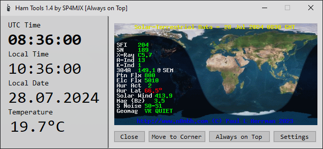
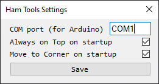

# Ham Tools by SP4MJX

Tool for Ham radio operators, providing basic info useful while having QSO: UTC clock, local clock and date, WX (temperature), and solar map from hamqsl.com.

## Requirements
- Arduino (tested on UNO; Nano doesn't work with some computers, but may work on other Arduino boards)
- Computer with x64 CPU
- Digital temperature sensor (tested with DS18B20)
- Necessary connectors and cables
- Metal case for Arduino (if the case is not made of metal, your radio may receive QRMs on the 2m band)

## Installation
1. Download .NET Framework 4.8 and Arduino IDE from their official websites.
2. Plug in your Arduino board.
3. Download and install the necessary drivers.
4. Download the `.ino` file from the releases on GitHub.
5. If you are using DS18B20, simply flash it and connect the sensor correctly (otherwise, rewrite the program to suit your needs).
6. Check in the Arduino IDE which COM port your board is using.
7. Download and install the installer from the releases on GitHub.
8. Start the program.
9. Complete the first-time configuration.
10. Restart the program.

Congratulations, you're all done!

## Usage
After installation, you can use the Ham Tools to display UTC and local time, current temperature, and view the solar map. Ensure all components are properly connected and configured for accurate information during your QSO.

